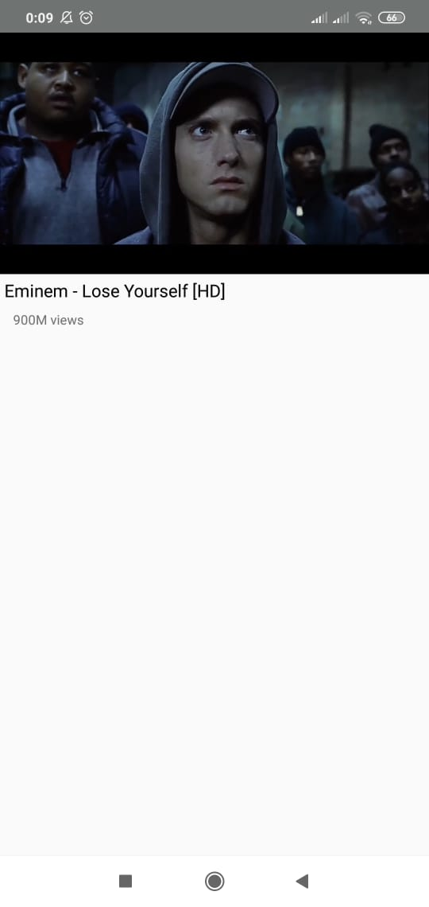

# MyYoutube
An android app  to view, play and search videos from Youtube. Implemented using  Youtube Api and Youtube Player Api and developed in **MVVM** pattern  

 Some pictures from an app  

  
"  "
"  "   

### Installing
apk link:  https://github.com/mirzemehdi/MyYoutube/raw/master/apk/myyoutube.apk

## Used Libraries  
  ***It is used MVVM pattern to develop this app***  
  
**YoutubeAndroidPlayerApi** - To watch videos using simple Youtube Player Api  
**ViewModel** - To save/restore state of activities/fragments  
**LiveData**  - To observe data   
**Retrofit**  - To handle network requests to a REST API  
**RecylerView**  - To show videos in the list  
**CardView**          

## Authors

----Developed by ***Mirzamehdi Karimov***----

